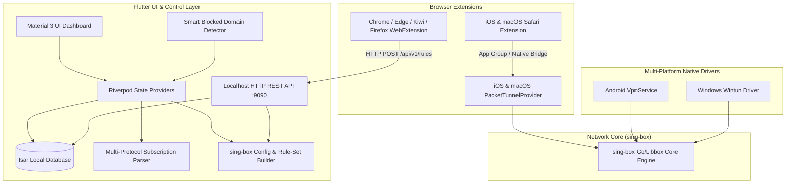

# 全平台 Flutter 代理客户端 (iOS / Android / macOS / Windows) 实现计划

> **For agentic workers:** REQUIRED SUB-SKILL: Use superpowers:subagent-driven-development to implement this plan task-by-task. Steps use checkbox (`- [ ]`) syntax for tracking.

**Goal:** 构建一款支持 iOS、Android、macOS、Windows 四终端的现代化 Flutter 代理客户端，基于 sing-box 内核，具备全协议解析、一键浏览器扩展加代理、域名智能建议与防重校验、以及基于直连异常的智能嗅探被墙域名引擎。

**Architecture:** 
- **表现层 (Flutter 3.x + Riverpod)**：四端共享 90%+ 代码，承载现代 UI、订阅解析、节点测速、路由规则构建与 Isar 本地数据库。
- **扩展与中枢通信 (Localhost REST API + Safari Native Bridge)**：为移动端及桌面浏览器扩展提供毫秒级一键加白通道。
- **网络核心 (sing-box / Libbox)**：通过各平台系统级虚拟网卡驱动（iOS/macOS NetworkExtension, Android VpnService, Windows Wintun）承载全机流量转发，支持基于 local rule-set 的零断流规则热重载。

**Architecture Diagram:**



**Tech Stack:** Flutter 3.41+, Dart 3.11+, `flutter_riverpod`, `isar`, `shelf`, `dio`, `tld`, `sing-box` (v1.9+), `flutter_libbox`

**Spec:** [2026-09-16-flutter-proxy-client-design.md](file:///Users/yinhua/Desktop/Agency/docs/superpowers/specs/2026-09-16-flutter-proxy-client-design.md)

## Global Constraints
- Flutter SDK >= 3.20.0, Dart >= 3.3.0.
- sing-box 内核编译必须指定 `GOMEMLIMIT=15MiB` 保证 iOS NetworkExtension 内存安全。
- 用户自定义域名规则必须在路由表中置于绝对第一优先级。
- 提取根域名时必须遵循公共后缀列表 (PSL / eTLD+1) 规范。
- 域名规则写入必须具备防重与覆盖校验。

---

### Task 1: 工程脚手架与基础环境初始化 (Scaffolding & Dependencies)

**Files:**
- Create: `pubspec.yaml`
- Create: `lib/main.dart`
- Create: `lib/app/theme.dart`
- Create: `lib/app/router.dart`
- Test: `test/widget_test.dart`

**Interfaces:**
- Consumes: None
- Produces: 基础 Flutter 多平台 App 骨架、Material 3 暗黑/明亮主题体系、Riverpod 根容器。

- [ ] **Step 1: 创建 Flutter 跨平台工程基础结构**
运行命令：
```bash
flutter create --org com.agency.proxy --platforms=ios,android,macos,windows agency_app
```

- [ ] **Step 2: 配置 pubspec.yaml 依赖库**
引入状态管理、数据库、网络服务与托盘支持：
```yaml
dependencies:
  flutter:
    sdk: flutter
  flutter_riverpod: ^2.5.1
  isar: ^3.1.0+1
  isar_flutter_libs: ^3.1.0+1
  path_provider: ^2.1.2
  dio: ^5.4.1
  shelf: ^1.4.1
  shelf_router: ^1.1.4
  tld: ^4.0.0
  tray_manager: ^0.2.1
  window_manager: ^0.3.8

dev_dependencies:
  flutter_test:
    sdk: flutter
  build_runner: ^2.4.8
  isar_generator: ^3.1.0+1
```

- [ ] **Step 3: 编写基础主题与入口测试**
在 `test/widget_test.dart` 中编写验证应用顺利启动的冒烟测试。

- [ ] **Step 4: 运行测试并提交**
```bash
flutter test
git add .
git commit -m "feat: initialize flutter multi-platform scaffolding and dependencies"
```

---

### Task 2: 订阅与节点数据模型及解析器 (Subscription & Node Protocol Parser)

**Files:**
- Create: `lib/core/models/proxy_node.dart`
- Create: `lib/core/parser/subscription_parser.dart`
- Create: `lib/core/parser/vmess_parser.dart`
- Create: `lib/core/parser/vless_parser.dart`
- Create: `lib/core/parser/clash_parser.dart`
- Test: `test/core/parser/subscription_parser_test.dart`

**Interfaces:**
- Consumes: 原始订阅链接、Base64 字符串、Clash YAML 内容。
- Produces: `List<ProxyNode>` 标准统一节点列表。

- [ ] **Step 1: 编写多协议解析的失败测试用例**
覆盖 `vmess://...`、`vless://...`、`trojan://...`、`ss://...` 及 Base64 订阅编码。
- [ ] **Step 2: 运行测试确认预期失败**
`flutter test test/core/parser/subscription_parser_test.dart`
- [ ] **Step 3: 实现多协议解析器核心逻辑**
完成 URI Query 解析、Base64 解密与 Clash 节点字典提取。
- [ ] **Step 4: 运行测试确认通过**
- [ ] **Step 5: 提交代码**
```bash
git add lib/core/models/ lib/core/parser/ test/core/parser/
git commit -m "feat: implement multi-protocol subscription parser"
```

---

### Task 3: 本地持久化与自定义域名规则数据库 (Isar DB & Rule Manager)

**Files:**
- Create: `lib/core/models/custom_domain_rule.dart`
- Create: `lib/core/models/sniffing_alert.dart`
- Create: `lib/core/database/database_service.dart`
- Create: `lib/core/utils/domain_utils.dart`
- Test: `test/core/utils/domain_utils_test.dart`
- Test: `test/core/database/database_service_test.dart`

**Interfaces:**
- Consumes: 用户输入或扩展同步的域名字符串。
- Produces: `DomainUtils.extractRootDomain(input)`，`DatabaseService.addCustomRule(...)` (带查重与覆盖检测)。

- [ ] **Step 1: 编写公共后缀 eTLD+1 提取与防重复校验单元测试**
测试场景：
1. `www.google.com` -> 根域名 `google.com`
2. `news.bbc.co.uk` -> 根域名 `bbc.co.uk`
3. 重复插入相同域名抛出 `DuplicateRuleException`
4. 已有 `google.com (domain_suffix)`，尝试插入 `mail.google.com` 提示已被覆盖。
- [ ] **Step 2: 运行测试确认预期失败**
- [ ] **Step 3: 实现 DomainUtils 与 DatabaseService 业务逻辑**
利用 `tld` 库实现准确的 eTLD+1 根域名提取与多级规则冲突检查。
- [ ] **Step 4: 运行测试确认全部通过**
- [ ] **Step 5: 提交代码**
```bash
git add lib/core/database/ lib/core/utils/ test/core/
git commit -m "feat: implement domain utils with eTLD+1 extraction and database deduplication"
```

---

### Task 4: sing-box 配置动态生成器 (Sing-Box Config & Rule-Set Generator)

**Files:**
- Create: `lib/core/config_builder/sing_box_config_builder.dart`
- Create: `lib/core/config_builder/routing_modes.dart`
- Test: `test/core/config_builder/sing_box_config_builder_test.dart`

**Interfaces:**
- Consumes: 当前选中的 `ProxyNode`、所选路由模式 (`RoutingMode`)、自定义域名规则列表 `List<CustomDomainRule>`。
- Produces: 符合 sing-box 1.9+ 规范的完整 `config.json` 与独立的 local `rule_set.json`。

- [ ] **Step 1: 编写配置生成器测试用例**
验证：
1. 自定义代理域名规则排在路由表的第一位（绝对最高优先级）。
2. 在“绕过大陆”模式下正确包含 `geoip-cn` 和 `geosite-cn` 直连规则。
3. Inbound 正确配置 TUN 虚拟网卡接口。
- [ ] **Step 2: 运行测试确认预期失败**
- [ ] **Step 3: 实现配置与规则集组装逻辑**
- [ ] **Step 4: 运行测试确认全部通过**
- [ ] **Step 5: 提交代码**
```bash
git add lib/core/config_builder/ test/core/config_builder/
git commit -m "feat: implement dynamic sing-box config builder with rule priority"
```

---

### Task 5: 本地 HTTP REST API 服务与浏览器扩展中枢 (Localhost Extension Sync API)

**Files:**
- Create: `lib/features/extension_sync/local_api_server.dart`
- Create: `lib/features/extension_sync/extension_api_controller.dart`
- Test: `test/features/extension_sync/local_api_server_test.dart`

**Interfaces:**
- Consumes: 来自浏览器扩展的 HTTP POST 请求。
- Produces: 监听 `http://127.0.0.1:9090`，提供 `/api/v1/rules/custom-domain` 接口。

- [ ] **Step 1: 编写 Local API 的 HTTP 接口集成测试**
测试发送含有子域名的 JSON，验证接口自动返回提取建议并成功入库。
- [ ] **Step 2: 运行测试确认预期失败**
- [ ] **Step 3: 使用 Shelf 搭建轻量级 Localhost HTTP 服务**
- [ ] **Step 4: 运行测试确认通过**
- [ ] **Step 5: 提交代码**
```bash
git add lib/features/extension_sync/ test/features/extension_sync/
git commit -m "feat: implement local HTTP REST API for browser extension sync"
```

---

### Task 6: 智能嗅探被墙域名引擎与自动影子校验 (Smart Sniffing Engine)

**Files:**
- Create: `lib/features/sniffing/sniffing_detector.dart`
- Create: `lib/features/sniffing/shadow_verifier.dart`
- Create: `lib/features/sniffing/sniffing_provider.dart`
- Test: `test/features/sniffing/sniffing_detector_test.dart`

**Interfaces:**
- Consumes: 直连连接错误日志与底层事件。
- Produces: 识别 TCP RST/超时异常，启动影子探针并发射智能建议事件。

- [ ] **Step 1: 编写直连阻断特征判定与影子校验单元测试**
- [ ] **Step 2: 运行测试确认预期失败**
- [ ] **Step 3: 实现 SniffingDetector 与 ShadowVerifier**
- [ ] **Step 4: 运行测试确认通过**
- [ ] **Step 5: 提交代码**
```bash
git add lib/features/sniffing/ test/features/sniffing/
git commit -m "feat: implement smart blocked domain sniffing and shadow verification"
```

---

### Task 7: 客户端核心 UI 界面实现 (Dashboard, Nodes, Rules, Sniffing Card)

**Files:**
- Create: `lib/features/home/home_screen.dart`
- Create: `lib/features/home/widgets/sniffing_alert_banner.dart`
- Create: `lib/features/home/widgets/speed_meter_card.dart`
- Create: `lib/features/nodes/node_list_screen.dart`
- Create: `lib/features/routing/custom_rules_screen.dart`
- Create: `lib/features/routing/widgets/add_domain_dialog.dart`
- Test: `test/features/routing/add_domain_dialog_test.dart`

**Interfaces:**
- Consumes: Riverpod 状态提供者 (`nodesProvider`, `connectionProvider`, `rulesProvider`, `sniffingAlertsProvider`)。
- Produces: 具备实时建议气泡、防重报错交互与一键加入代理按钮的响应式界面。

- [ ] **Step 1: 编写添加域名对话框的交互测试 (输入子域名实时显示根域名建议气泡)**
- [ ] **Step 2: 运行测试确认预期失败**
- [ ] **Step 3: 编写 Flutter UI 界面与交互动效**
- [ ] **Step 4: 运行测试确认通过**
- [ ] **Step 5: 提交代码**
```bash
git add lib/features/home/ lib/features/nodes/ lib/features/routing/ test/features/
git commit -m "feat: build responsive UI dashboard, rule manager and smart sniffing card"
```

---

### Task 8: 浏览器扩展开发 (iOS Safari Web Extension & 通用 WebExtension)

**Files:**
- Create: `extensions/browser_extension/manifest.json`
- Create: `extensions/browser_extension/popup.html`
- Create: `extensions/browser_extension/popup.js`
- Create: `ios/SafariExtension/SafariWebExtensionHandler.swift`
- Create: `ios/SafariExtension/Info.plist`

**Interfaces:**
- Consumes: 浏览器当前标签页 URL。
- Produces: 一键添加根域名代理并提示操作结果。

- [ ] **Step 1: 编写通用 Manifest V3 扩展 (popup 界面与 background 脚本)**
实现提取当前标签页 hostname，显示根域名建议，调用 `http://127.0.0.1:9090`。
- [ ] **Step 2: 编写 iOS/macOS Safari Web Extension 原生 Target**
配置 App Group 共享沙盒写入逻辑。
- [ ] **Step 3: 验证扩展交互**
- [ ] **Step 4: 提交代码**
```bash
git add extensions/ ios/SafariExtension/
git commit -m "feat: add safari web extension and universal manifest v3 browser extension"
```

---

### Task 9: 四平台原生 VPN 隧道接入与 sing-box 运行时打包

**Files:**
- Create: `ios/PacketTunnel/PacketTunnelProvider.swift`
- Create: `android/app/src/main/kotlin/com/agency/proxy/VpnServiceImpl.kt`
- Create: `macos/Runner/AppDelegate.swift`
- Create: `windows/runner/wintun_manager.cpp`
- Create: `lib/core/bridge/libbox_bridge.dart`

**Interfaces:**
- Consumes: sing-box `config.json` 与启动参数。
- Produces: 全系统虚拟 TUN 网卡接口，双向推送连接状态与网速。

- [ ] **Step 1: 配置 iOS NetworkExtension 与 App Group 权限**
- [ ] **Step 2: 配置 Android VpnService 与前台服务通知栏**
- [ ] **Step 3: 配置 macOS 托盘与 Windows Wintun 驱动打包**
- [ ] **Step 4: 实现 Flutter Platform Channel 统一控制桥**
- [ ] **Step 5: 提交代码**
```bash
git add ios/ android/ macos/ windows/ lib/core/bridge/
git commit -m "feat: integrate native tunnel drivers and sing-box bridge for 4 platforms"
```

---

### Task 10: 端到端全链路联调与验证验收 (E2E Verification)

- [ ] **Step 1: 运行全套单元测试与集成测试**
```bash
flutter test
```
- [ ] **Step 2: 验证四端基础代理连通性**
- [ ] **Step 3: 验证自定义域名高优先级强分流**
- [ ] **Step 4: 验证浏览器扩展一键添加与无感热重载**
- [ ] **Step 5: 验证直连阻断智能嗅探与首页提示卡片**
- [ ] **Step 6: 输出 Walkthrough 总结**
